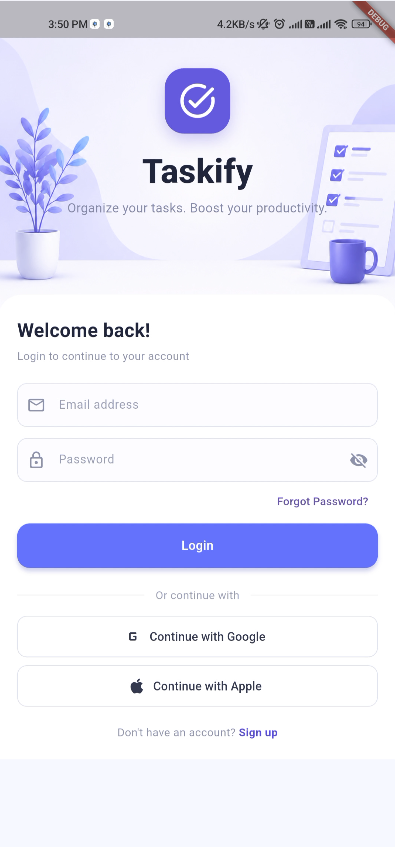
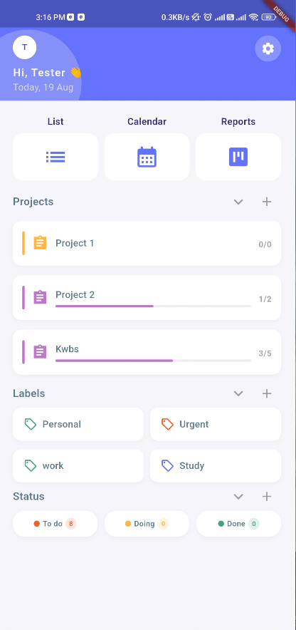
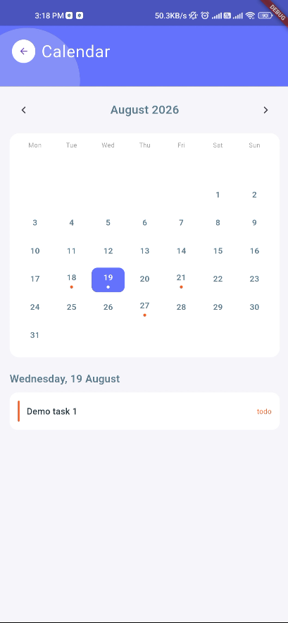
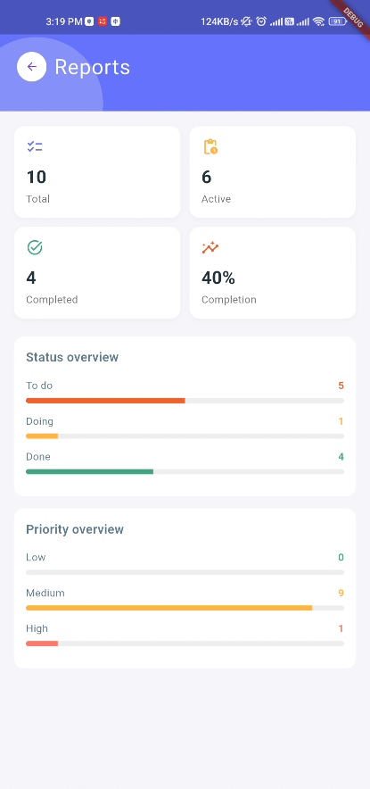

# Taskify - Flutter Productivity App

A productivity app built with Flutter and Firebase for managing projects, independent tasks, labels, schedules, and progress.

## Screenshots

### Login


### Dashboard


### Calendar


### Reports


## Features

### Authentication and Account
- Email and password signup and login
- Persistent Firebase Auth sessions
- Edit profile name and email
- Change password with reauthentication
- Logout

### Projects and Project Tasks
- Create, edit, and delete projects
- Set project descriptions, deadlines, priorities, colors, and status
- Add project tasks with descriptions, priorities, labels, and due dates
- Move tasks between Todo, Doing, and Done with swipe actions
- Project progress tracking and pending-write indicators

### Independent Tasks
- Tasks not tied to a project
- Sections for No due date, Today, Tomorrow, and This week
- Swipe actions for status changes, editing, and deletion
- Completed tasks are hidden from My Tasks and available through the Done status view

### Labels
- Create, edit, and delete labels
- New users receive built-in Work, Personal, and Urgent labels
- Assign Firestore-backed labels to independent tasks
- View tasks assigned to a label

### Calendar and Reports
- Monthly calendar with selectable dates
- Shows independent tasks scheduled for the selected date
- Task markers and month navigation
- Reports for total, active, completed, and completion percentage
- Status and priority breakdowns

### Dashboard
- Project progress overview
- Independent task status counts
- Quick navigation to List, Calendar, and Reports
- Collapsible Projects, Labels, and Status sections
- Reusable empty states for sections without data

### Offline Support
- Firestore local persistence for reads and writes
- Pending changes synchronize when the device reconnects
- User-owned Firestore data protected by security rules

## Tech Stack

| Layer | Technology |
|---|---|
| Framework | Flutter |
| Language | Dart |
| Backend | Firebase Auth and Cloud Firestore |
| State Management | GetX |
| Local Cache | Firestore offline persistence |
| UI Components | flutter_slidable, intl |

## Project Structure

```text
lib/
├── auth/
├── pages/
│   ├── dashboard/
│   │   ├── dashboard_screen.dart
│   │   └── status_detail_screen.dart
│   ├── calendar/
│   │   ├── controllers/calendar_controller.dart
│   │   └── screens/calendar_screen.dart
│   ├── labels/
│   │   ├── controllers/label_controller.dart
│   │   ├── model/label_model.dart
│   │   ├── services/label_services.dart
│   │   └── screeens/
│   │       ├── add_label_screen.dart
│   │       └── label_detail_screen.dart
│   ├── my_task/
│   │   ├── controllers/task_controller.dart
│   │   ├── models/task_model.dart
│   │   ├── services/task_service.dart
│   │   └── screens/
│   │       ├── my_task_screen.dart
│   │       └── add_independent_task_screen.dart
│   ├── projects/
│   ├── reports/screens/reports_screen.dart
│   └── settings/settings_screen.dart
└── widgets/
    ├── dashboard_header.dart
    ├── empty_state.dart
    └── page_header.dart
```

## Firestore Structure

```text
users/
  {userId}/
    projects/{projectId}/
      tasks/{taskId}/
    tasks/{taskId}/
    labels/{labelId}/
```

Independent task documents contain `id`, `title`, `description`, `status`, `priority`, `labels`, `dueDate`, and `createdAt`.

## Getting Started

### Prerequisites
- Flutter SDK
- Dart SDK
- A Firebase project with Authentication and Firestore enabled

### Installation

```bash
flutter pub get
```

Configure Firebase with FlutterFire:

```bash
dart pub global activate flutterfire_cli
firebase login
flutterfire configure
```

Deploy Firestore security rules:

```bash
firebase deploy --only firestore:rules
```

Run the app:

```bash
flutter run
```

## Author

**Narendra Chapagain**

- Portfolio: [narendrachapagain.com.np](https://narendrachapagain.com.np)
- GitHub: [@7s_kwbs](https://github.com/7s-kwbs)

## License

This project is licensed under the MIT License.
